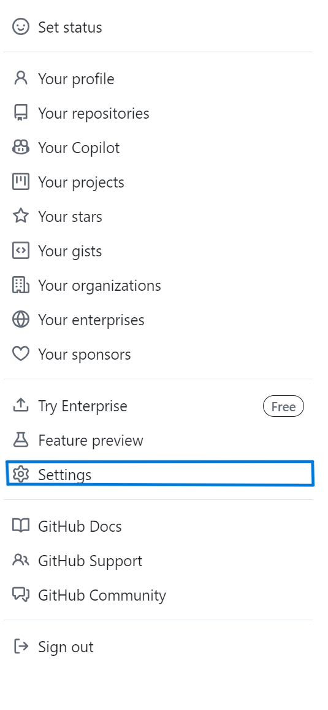
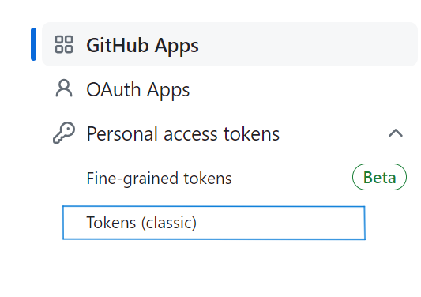
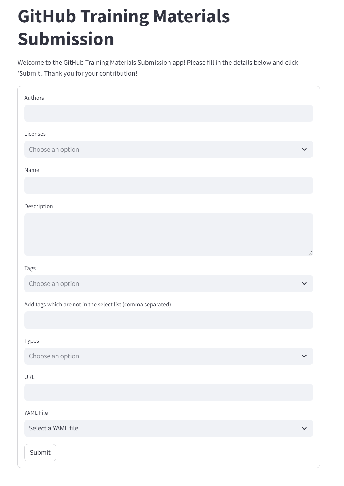
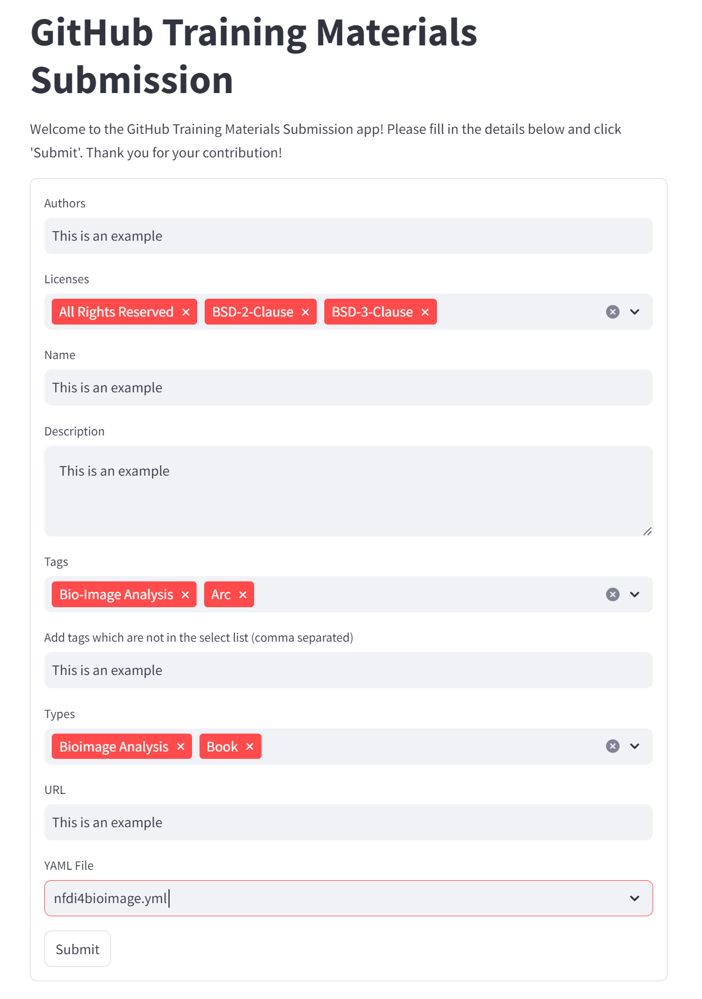

# AppSubmitter Guidance
# How to contribute

This repository contains lists of training materials. It is extensible using GitHub pull requests. You can find a how-to guide at the bottom of this page. The format for entries in the repository is documented on the next page.

## Quick contributing shortcut:

If you're too busy to enter everything in detail yourself, please create a [GitHub issue](https://github.com/NFDI4BIOIMAGE/training/issues) with a link to the materials you want to include in our list. We can take care of all the details.

## What to contribute

Consider adding your favorite training materials and resources. If you know a collection of resources, add it, but do not add all individual entries of the collection. We are working on collecting them automatically ([more information](https://github.com/NFDI4BIOIMAGE/training/issues/2)). However, if there are specific entries in such a collection that you think are particularly valuable, feel free to add them now.

## Inclusion criteria

We will consider merging links to all educative materials related to research data management, especially in the bio-imaging context, and bio-image analysis.

We would like to collect links to resources in various formats/content types, including slides, posters, publications, blog posts, example data, collections (of links to other materials), and more.

## Exclusion criteria

We will only merge links to materials behind a paywall in exceptional cases. We will also not merge links to materials that primarily advertise commercial products. However, if there are openly accessible training resources for commercial software, we welcome links to these resources.

## Maintenance of contributions

We reserve the right to remove and modify entries in this collection at any time.

# Using the AppSubmitter

The AppSubmitter streamlines the process of contributing new training materials to our repository. Follow these steps to use the AppSubmitter:

## Prerequisites

Ensure you have the necessary Python libraries installed. Run the following command to install them:

```
pip install streamlit pygithub pyyaml
```

Make sure you have set your GitHub API key as an environment variable. Here's how:

1. Open Command Prompt by pressing Win + R, typing `cmd`, and pressing Enter.
2. Verify that the environment variable has been set by running `echo %GITHUB_API_KEY%`.
3. If you don't have your API key, go to your GitHub account settings and follow these steps:
    - Click your profile photo in the upper-right corner of any page on GitHub, then click Settings.
    
    
    - In the left sidebar, click Developer settings.
    
    - Under Personal access tokens, click Tokens (classic) to generate your API key.
    
4. Once you have your API key, set it as an environment variable using the following command in your terminal:
    ```
    setx GITHUB_API_KEY "your_github_api_key"
    ```

## Running the AppSubmitter

Navigate to the `scripts` folder using the following command:

```
cd ../scripts
```

Run the AppSubmitter with the following command that you will see the AppSubmitter interface:

```
streamlit run appsubmitter.py
```


With the help of the AppSubmitter interface where you can easily add the author, name, description, URL, select the license, tags, type, and choose the YAML file you want to upload.



After clicking Submit, a pull request will be created.


If you think your contribution is substantial, feel free to send a pull request adding yourself to the list of authors [here](https://github.com/NFDI4BIOIMAGE/training/blob/main/docs/_config.yml#L2).


