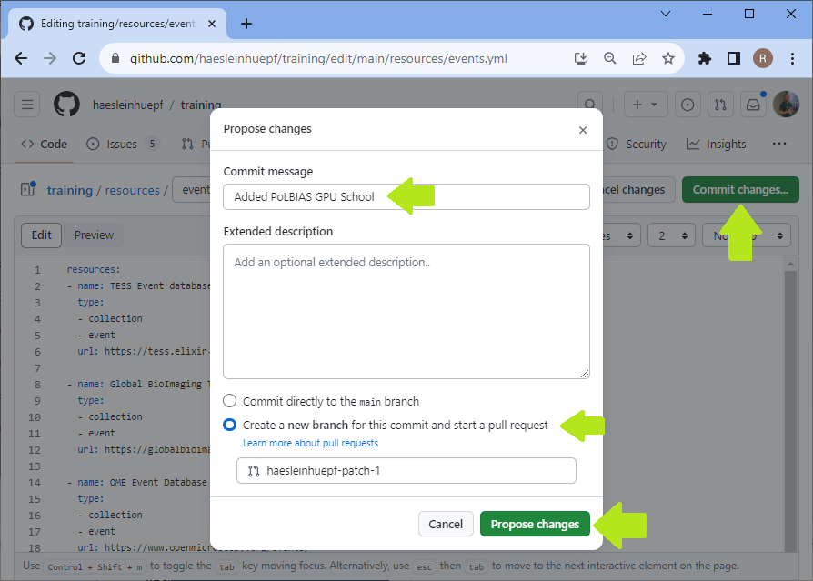

# How to contribute

This repository contains lists of training materials. It is extensible using github pull requests. You find a how-to guide on the bottom of this page. The format for entries in the repository is documented on the next page.

## What to contribute

Consider adding your favorite training materials and resources. In case you know a collection of resources add it but do not add all individual entries of the collection. We [will be working on collecting them automatically](https://github.com/NFDI4BIOIMAGE/training/issues/2). However, if there are specific entries in such a collection you think are in particlar valuable, feel free to add them now.

## Inclusion criteria

We will consider merging links to all materials which are educative. This can be online tutorials like videos, written tutorials, blog posts and publications. Relevant topics are:
* Research Data Management, in particular but not limited to the bio-imaging context
* Bio-image Analysis

We would like to collect links to resources including various formats / content types:
* Slides
* Posters
* Publications
* Blog posts
* Example data
* ...

## Exclusion criteria

We will only in exceptional cases merge links to materials which are located behind a paywall. We will also not merge links to materials which serve mostly advertising commercial products. However, if there are openly accessible training resources for commercial software, we welcome links to these resources.

## Maintenance of contributions

We reserve the right to remove and modify entries of this collection at any point in time.

## Step-by-step tutorial

If you want to contribute a new link to some training materials, got to the yml file, e.g. to [events.yml](https://github.com/NFDI4BIOIMAGE/training/blob/main/resources/events.yml) and click the `edit` button.

Add your modification, e.g. at the very end of this file.

Save the file and enter a meaningful commit message. Write what you added to the file in very short.

Submit a pull-request with a short message of what you are proposing and why.

After submitting the pull-request, wait for a second while the tests are running.

Wait until the tests have passed. If they don't, check the error message and modify the file on your branch again until the tests pass. If the error is not related to your changes, please let us know and we will take care of it.

If you think your contribution is substantial, feel free to send a pull-request adding yourself to the list of authors [here](https://github.com/NFDI4BIOIMAGE/training/blob/main/docs/_config.yml#L2).
