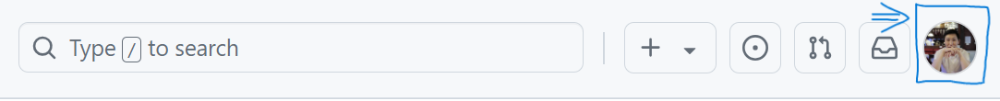
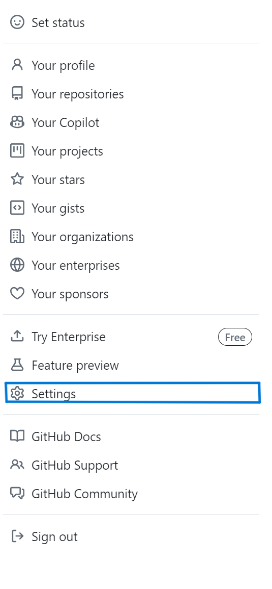
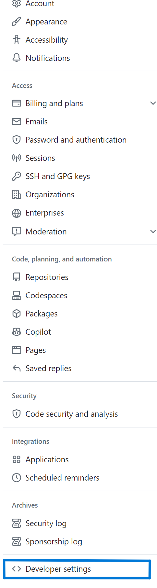
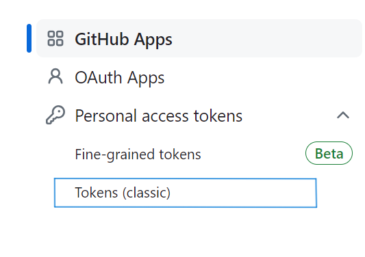
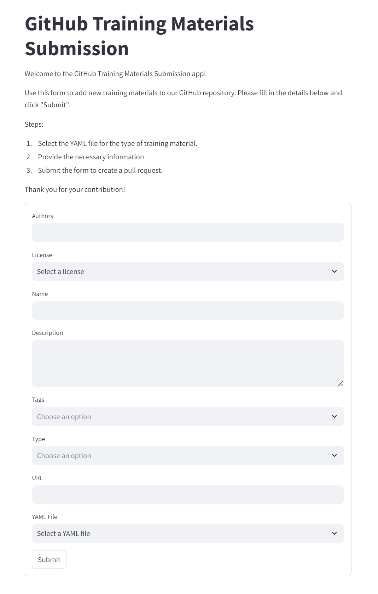
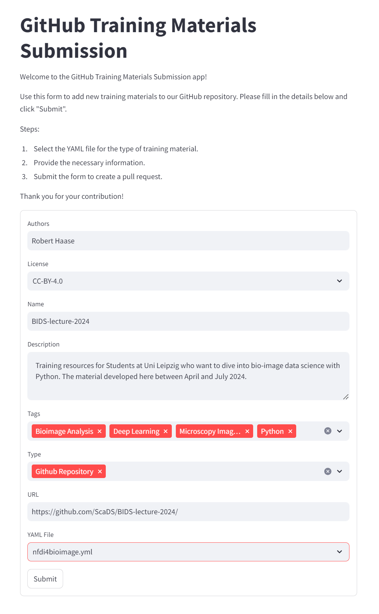
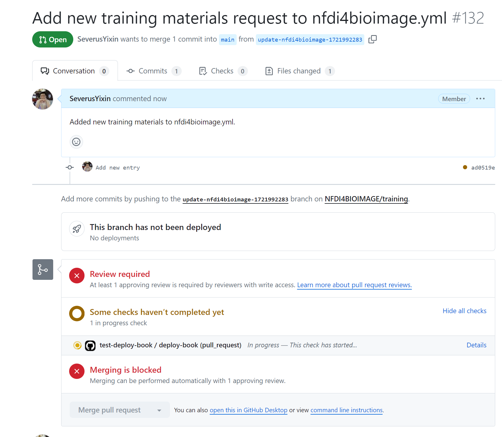

# Using the Training Materials Submission App

The Training Materials Submission App streamlines the process of contributing new training materials to our repository. Follow these steps to use the App:

## Prerequisites

Ensure you have the necessary Python libraries installed. Run the following command to install them:

```
pip install streamlit pygithub pyyaml pandas
```

Make sure you have set your GitHub API key as an environment variable. Here's how:

1. Open Command Prompt by pressing Win + R, typing `cmd`, and pressing Enter.
2. Verify that the environment variable has been set by running `echo %GITHUB_API_KEY%`.
3. If you don't have your API key, go to your GitHub account settings and follow these steps:
    - Click your profile photo in the upper-right corner of any page on GitHub, then click Settings.
    
    
    - In the left sidebar, click Developer settings.
    
    - Under Personal access tokens, click Tokens (classic) to generate your API key.
    
4. Once you have your API key, set it as an environment variable using the following command in your terminal:
    ```
    setx GITHUB_API_KEY "your_github_api_key" (for Windows)
    export GITHUB_API_KEY="your_github_api_key" (for macOS)
    ```

## Running the Training Materials Submission App

Navigate to the `scripts` folder using the following command:

```
cd ../scripts
```

Run the App with the following command that you will see the AppSubmitter interface:

```
streamlit run appsubmitter.py
```


With the help of the AppSubmitter interface where you can easily add the author, name, description, URL, select the license, tags, type, and choose the YAML file you want to upload.



After clicking Submit, a pull request will be created.



If you think your contribution is substantial, feel free to send a pull request adding yourself to the list of authors [here](https://github.com/NFDI4BIOIMAGE/training/blob/main/docs/_config.yml#L2).


