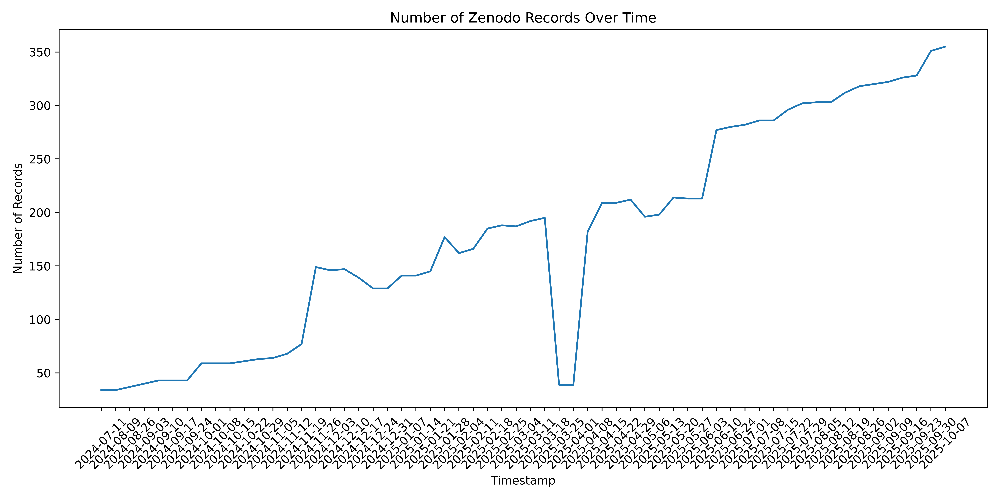
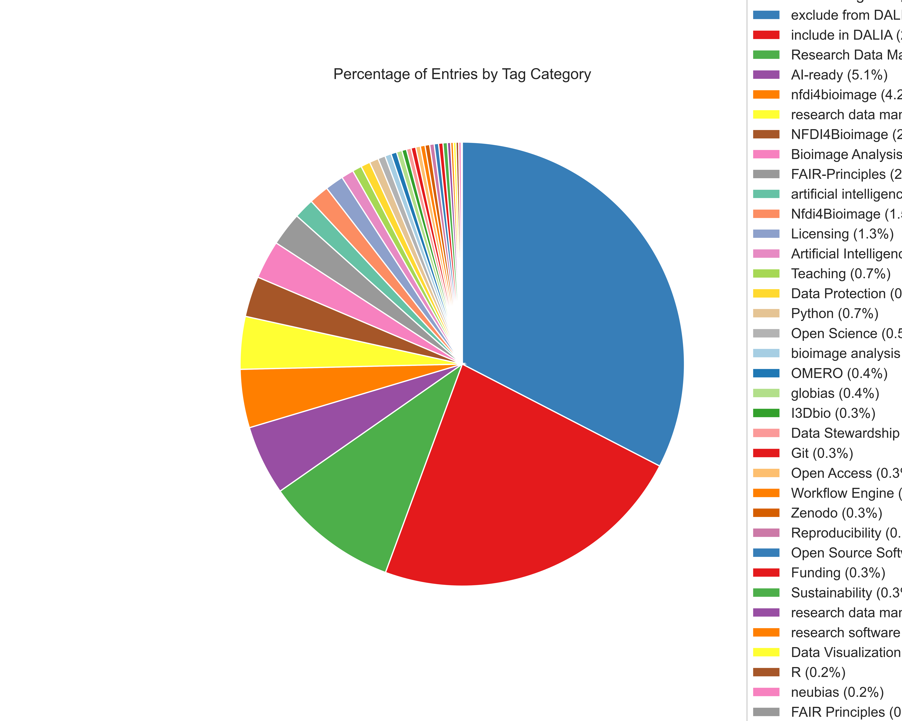
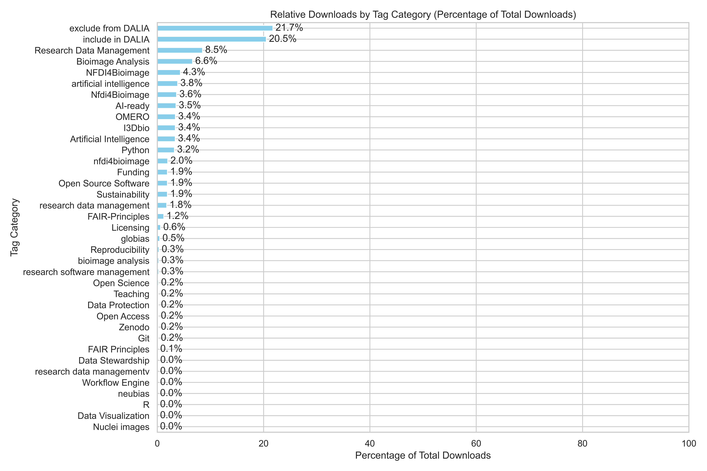
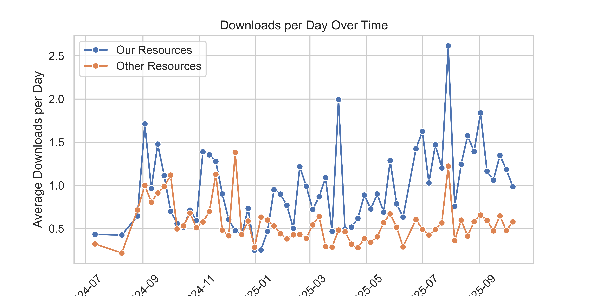

## Statistics

We are using this resource to track some basic statistics of how resources are used, e.g. download and view statistics of Zenodo records in our collection:

For this, we are analysing records hosted on the Zenodo platform only.

Also, we can investigate the distribution among different topics:

And compare different groups of people:

