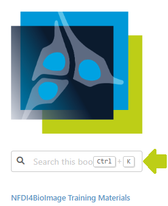

# Training materials

This repository contains a collection of links to training materials and related resources. The collection can be browsed under this URL:

https://NFDI4BIOIMAGE.github.io/training

It is maintained using [Jupyter lab](https://jupyterlab.readthedocs.io/en/stable/) and build using [Jupyter book](https://jupyterbook.org/intro.html).

To edit this book, install depencencies like this:

```
pip install jupyterlab jupyter-book jupyterlab-spellchecker

git clone https://github.com/NFDI4BIOIMAGE/training
cd training
jupyter lab
```

To build the book, you can run this from the same folder (tested on Windows only):
```
python scripts/generate_link_lists.py
```

```
jupyter-book build docs/
```

Afterwards, there will be a `docs/_build/html/index.html` file which should look like this:



 
