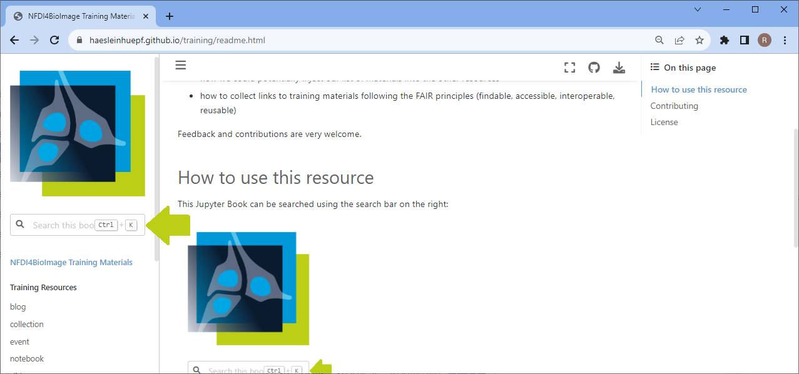

# Training materials

This repository contains a collection of links to training materials and related resources. The collection can be browsed under this URL:

https://NFDI4BIOIMAGE.github.io/training

It is maintained using YAML resources and rendered as a static JavaScript search interface.

To edit this book, install depencencies like this:

```
pip install jupyterlab jupyter-book jupyterlab-spellchecker

git clone https://github.com/NFDI4BIOIMAGE/training
cd training
jupyter lab
```

To build the website, you can run this from the same folder:
```
python scripts/build_search_site.py
```

Afterwards, there will be a `dist/index.html` file which should look like this:

 

 
 
